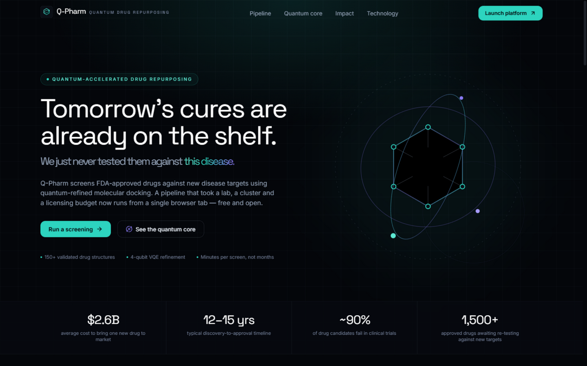
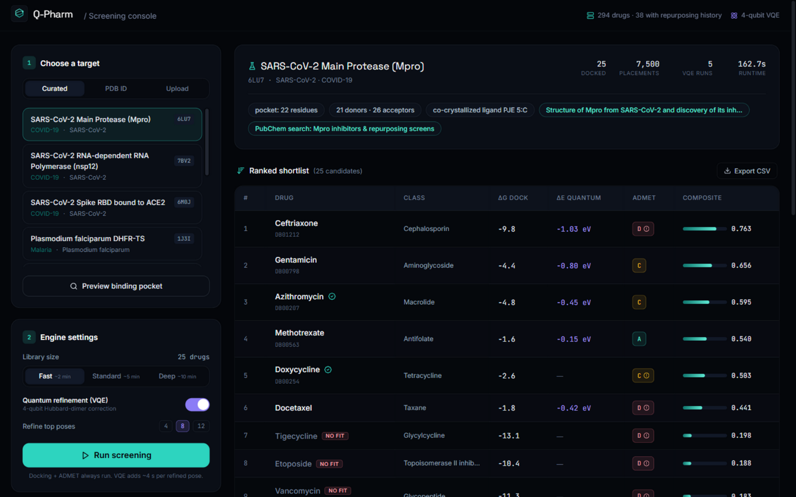
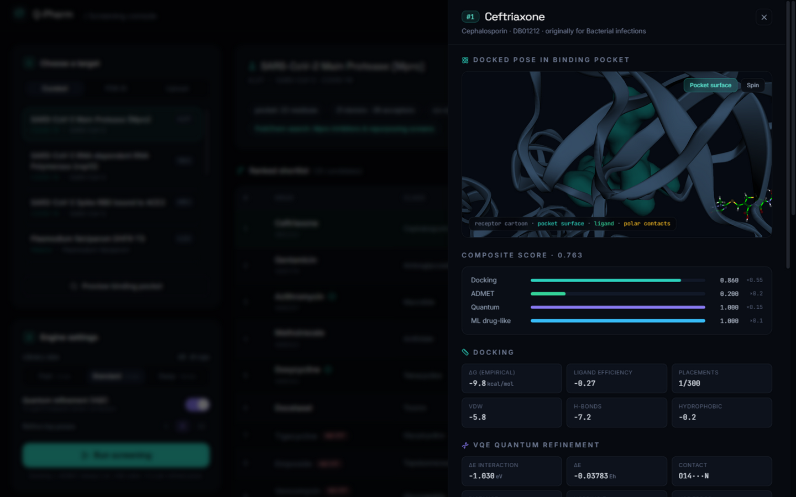

# Q-Pharm

**Quantum-accelerated drug repurposing engine** — screen FDA-approved drugs against any
protein target with VQE-refined molecular docking, ADMET filtering and an interactive 3D
console. Free, open source, software-only.



<p align="center">
  
  
  
  
  
  
</p>

---

## Why this exists

Developing a new drug takes **12–15 years** and **~$2.6 billion**. Yet thousands of
approved drugs may already bind targets they were never tested against — *drug
repurposing*. Remdesivir (an Ebola asset) became COVID-19's first authorized therapy;
sildenafil went from angina to a billion-dollar indication. The bottleneck is
**screening**: simulating how a whole pharmacopoeia fits into a new disease target was
reserved for teams with docking clusters and licensing budgets.

Q-Pharm compresses that pipeline into a single open web tool: give it a PDB ID, and it
returns a ranked, evidence-linked shortlist of approved drugs — with the 3D poses, the
interaction map, the quantum correction and the ADMET profile of every hit.

## How it works

```
 PDB ID / upload ──►  Target structure (RCSB fetch, PDB parser)
                          │
                          ▼
                 Binding-pocket detection
        (co-crystal ligand site or LIGSITE-style cavity search,
         atom typing: donors / acceptors / hydrophobes / aromatics)
                          │
                          ▼
                 Library prefilter (294 curated FDA drugs,
                 pharmacophore complementarity + Lipinski)
                          │
                          ▼
        Quantum-classical docking  ◄─── RDKit ETKDG conformers
        · cavity-anchored rigid-body sampling
        · empirical scoring (LUDI-style): clash, vdW, H-bonds,
          hydrophobic contacts, electrostatics, π-stacking, rotB
        · greedy refinement with H-bond "snap" moves
                          │
                          ▼
                 VQE quantum refinement (top poses)
        strongest polar contact → two-site Hubbard dimer →
        Jordan-Wigner → 4-qubit Hamiltonian → VQE (L-BFGS-B,
        parameter-shift gradients) → charge-transfer ΔE
                          │
                          ▼
        ADMET + ML re-ranking ──► Composite ranking ──► Console
        (Lipinski, Veber, PAINS/BRENK, ESOL; logistic          with 3D poses,
        drug-likeness model; S = .55·dock + .20·ADMET          interaction map,
        + .15·quantum + .10·ML)                                evidence links, CSV
```

## Quickstart

Requirements: **Python 3.10–3.12** and **Node.js 18+** (only for rebuilding the frontend;
a production build is included).

**1. Backend**

```bash
cd backend
python -m venv .venv
# Windows:  .venv\Scripts\activate      macOS/Linux:  source .venv/bin/activate
pip install -r requirements.txt
uvicorn app.main:app --port 8010
```

**2. Frontend (development mode)**

```bash
cd frontend
npm install
npm run dev          # http://localhost:5173, proxies /api to :8010
```

**3. Or run everything from one server** (recommended):

```bash
cd frontend && npm install && npm run build   # produces frontend/dist
cd ../backend && uvicorn app.main:app --port 8010
# open http://localhost:8010 — landing page, console and API from one process
```

The first real screening takes **1–6 minutes** depending on library size — the pipeline
streams progress to the console live.

## The quantum core, honestly

Classical docking scores treat electrons implicitly. Q-Pharm adds an explicit quantum
correction for the strongest polar contact of each top pose: the donor–acceptor pair is
modelled as a **two-site, two-orbital Hubbard dimer** — 4 fermionic modes mapped to
4 qubits via Jordan-Wigner, with the hopping `t = t₀·exp(−(d−2.9 Å)/0.9)`, on-site
repulsion `U` from chemical hardness, and level offset `δ` from the electronegativity
difference. A VQE (hardware-efficient RY ansatz, L-BFGS-B with exact parameter-shift
gradients, particle-number penalty `λ(N−2)²`) finds the ground state; the difference
between coupled and decoupled sites gives the charge-transfer stabilization `ΔE`.

This is a **proof-of-concept refinement** — a real quantum algorithm on a real qubit
Hamiltonian, validated against exact diagonalization (VQE error typically < 10⁻⁶ Eh in
tests), not a production ab initio engine. It follows the same hybrid quantum-classical
pattern published for near-term drug discovery (see [docs/SCIENCE.md](docs/SCIENCE.md)).
Scaling to full active-space quantum chemistry is the obvious next step.

## Validation

* `backend/tests/` — 20 tests: Hubbard-dimer analytic ground state, Pauli decomposition
  round-trip, VQE accuracy, PDB parsing, pocket detection, docking geometry/scoring,
  ADMET ranges, ML sanity. Run with `pytest` from `backend/`.
* Curated targets were verified against RCSB at build time — e.g. screening **6LU7**
  (SARS-CoV-2 Mpro) reproduces the known active site (His41, Cys145, Met165, Glu166,
  Gln189…), and the engine's pocket detector lands within the co-crystal ligand site.

## API

| Endpoint | Description |
|---|---|
| `GET /api/health` | service + library versions |
| `GET /api/stats` | library size, classes, quantum config |
| `GET /api/targets` | curated, RCSB-verified screening targets |
| `GET /api/drugs?q=&limit=` | browse/search the drug library |
| `POST /api/targets/inspect` | pocket preview for a PDB ID |
| `POST /api/targets/upload-inspect` | pocket preview for an uploaded PDB |
| `POST /api/jobs` | start a screening (returns job id) |
| `GET /api/jobs/{id}` | status/progress, full result when done |
| `GET /api/jobs/{id}/protein.pdb` | target structure |
| `GET /api/jobs/{id}/poses/{rank}.sdf` | docked pose as SDF |
| `GET /api/jobs/{id}/export.csv` | full ranking as CSV |

Interactive OpenAPI docs at `/docs` when the server runs.

## Project structure

```
q-pharm/
├── backend/
│   ├── app/
│   │   ├── api/routes.py          FastAPI surface
│   │   ├── core/
│   │   │   ├── pdb.py             fetch/parse, ligand & pocket detection
│   │   │   ├── pharmacophore.py   receptor + ligand atom typing
│   │   │   ├── docking.py         conformers, placement, snap refinement
│   │   │   ├── scoring.py         empirical scoring function
│   │   │   ├── quantum.py         Hubbard dimer, JW mapping, VQE
│   │   │   ├── admet.py           Lipinski/Veber/PAINS/ESOL profiling
│   │   │   ├── ml.py              logistic drug-likeness model
│   │   │   ├── pipeline.py        stage orchestration + composite score
│   │   │   └── jobs.py            job store with progress
│   │   └── data/                  drug library, targets, evidence, ML model
│   ├── scripts/build_data.py      rebuilds data from PubChem + RCSB
│   └── tests/                     pytest suite
├── frontend/                      React 18 + Vite + Tailwind console
├── docs/                          SCIENCE.md, ARCHITECTURE.md, screenshots
└── scripts/                       dev utilities
```

## Screenshots

| Console | 3D pose & interactions |
|---|---|
|  |  |

## Limitations (read this)

* **Rigid receptor, approximate docking.** The empirical scoring function and
  cavity-anchored sampling are deliberately simplified; scores are comparable *within a
  run*, not against real ΔG. Side-chain flexibility, water and protonation states are
  not modelled.
* **Quantum layer is illustrative.** One effective 4-qubit model per contact, on a
  statevector simulator.
* **ADMET is a rule-based + tiny-ML estimate**, not a pharmacokinetics prediction.
* **Drug library** is a curated 294-compound open subset (PubChem-validated structures),
  not the full DrugBank.
* **Research & education only.** Outputs are hypothesis generators. Nothing here is
  medical advice or suitable for clinical decision-making.

## License

MIT — see [LICENSE](LICENSE). Drug structures via PubChem; protein structures via RCSB
PDB; thank you to the open-source scientific Python community.
